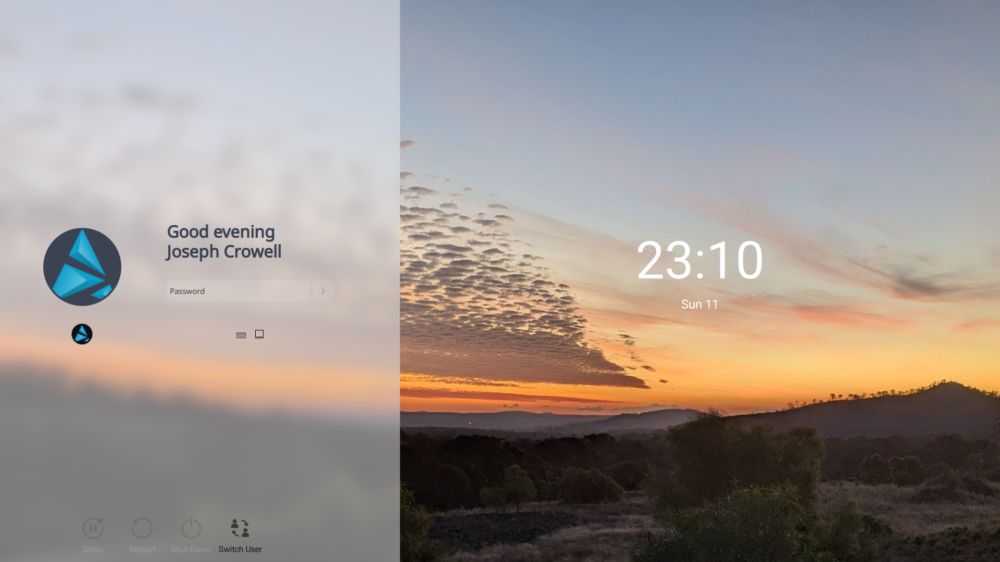

# Sonic Silver SDDM Theme (KDE Plasma 6)

  

---------
Sonic Silver is an SDDM theme fork based on the , with fixes.

This SDDM login screen by offers:

## Revamped Digital Clock

    The traditional digital clock has been replaced with a modern,
    stylish variant, strategically positioned at the center-right of the screen for enhanced visibility and design.

## Enhanced Blur Effect

    The background blur effect has been modified with a Nord-inspired tint,
    creating a cool and elegant atmosphere that complements the overall aesthetics.

## Contemporary Aesthetic

    With a clean and minimalist interface, Sonic Silver blends functionality with attractive design,
    making it ideal for users seeking a login experience that stands out for its modernity and refinement.

## Customizable Fork

    Built on Andromeda-KDE and ready to adapt to your personal preferences
    modifying the main.qml or login.qml file.

This project is perfect for KDE users who want to personalize and modernize the appearance of their SDDM session manager without sacrificing the simplicity and usability of the original Andromeda-KDE SDDM Theme.

---------

### Light variant

  

Contributions, suggestions, and feedback are welcome. Thank you for using SonicDE!

---------

## How to set up

    ```bash
    git clone https://github.com/Sonic-DE/silver-sddm
    sudo cp -r ~/silver-sddm/Sonic-Silver /usr/share/sddm/themes/
    sudo cp -r ~/silver-sddm/Sonic-Silver-Light /usr/share/sddm/themes/
    ```

### If you want upgrade Sonic Silver, delete the old versions

    ```bash
    git clone https://github.com/Sonic-DE/silver-sddm
    sudo rm -r /usr/share/sddm/themes/Sonic-Silver
    sudo rm -r /usr/share/sddm/themes/Sonic-Silver-Light
    ```

### Then install new versions of the theme

    ```bash
    sudo cp -r ~/silver-sddm/Sonic-Silver /usr/share/sddm/themes/
    sudo cp -r ~/silver-sddm/Sonic-Silver-Light /usr/share/sddm/themes/
    ```
